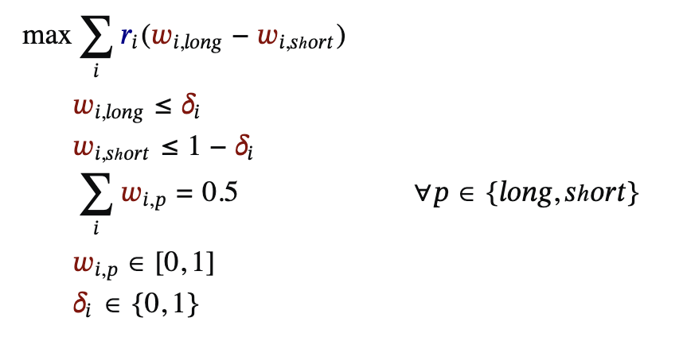
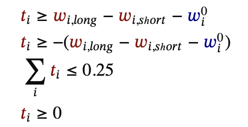

<div align="center">

# 📈 Cornell Trading Competition 2023

### Algorithmic Options Trading System — VIX & SPX Index Derivatives

[](https://python.org/)
[](https://pandas.pydata.org/)
[](https://numpy.org/)
[](https://coin-or.github.io/pulp/)
[](https://github.com/ranaroussi/yfinance)

**Algorithmic options trading system exploiting the inverse correlation between VIX and SPX to generate directional trade signals and execute margin-aware long-short portfolios.**

[Cornell Trading Competition](https://github.com/Shrey-Varma/CTC23) · [Strategy](#strategy) · [Implementation](#implementation)

</div>

---

## Overview

Built for the **Cornell Quantitative Trading Competition 2023**, this system implements a systematic, rules-based options trading strategy on VIX call/put derivatives and SPX index options. The engine exploits the well-documented inverse relationship between the S&P 500 (SPX) and the CBOE Volatility Index (VIX) to generate directional signals, then applies linear programming to construct an optimal long-short portfolio subject to margin and turnover constraints.

The portfolio operates on a **$1 million notional** across equities in Brazil, Mexico, India, and the US.

---

## Strategy

### Inverse Correlation Exploitation

The VIX ("fear index") and SPX exhibit a persistent negative correlation (~−0.7 to −0.8). When SPX momentum is bearish:
- **Go long VIX calls** (volatility expected to spike)
- **Cover with VIX puts** (hedge against mean-reversion)

When SPX momentum is bullish:
- **Short VIX calls** (volatility expected to compress)
- **Go long VIX puts**

### Signal Generation

Directional signals are derived from momentum indicators calculated on daily SPX Open-to-Close returns:

```
Expected Return(t) = (Close(t) - Open(t)) / Open(t)
```

A rolling window (first 7 days used for initialization) establishes the baseline momentum regime. Subsequent signals are generated day-by-day on a single-period basis.

### Portfolio Construction — Linear Programming

At each rebalancing step, the optimal portfolio weights are solved via a Linear Program (LP) using the [PuLP](https://coin-or.github.io/pulp/) solver:

**Objective:**
```
Maximize  Σ  r_i · (w_L_i − w_S_i)
           i
```
where `r_i` is the expected daily return, `w_L_i` is the long weight, and `w_S_i` is the short weight for asset `i`.

**Constraints:**

| Constraint | Description |
|---|---|
| `w_L_i ≤ δ_i` | Long weights gated by binary direction indicator |
| `w_S_i ≤ 1 − δ_i` | Can't simultaneously long and short the same asset |
| `Σ w_L_i = 0.5` | Long book fully invested (50% of portfolio) |
| `Σ w_S_i = 0.5` | Short book fully invested (50% of portfolio) |
| `Σ t_i ≤ 0.25` | Total turnover capped at 25% per period |
| `t_i ≥ \|Δw_i\|` | Turnover linearized via auxiliary variables |
| `w_L_i, w_S_i ∈ [0, 1]` | Weight bounds |
| `δ_i ∈ {0, 1}` | Binary direction variables (MILP) |

The **turnover constraint** (`Σ t_i ≤ 0.25`) enforces realistic trading costs — limiting total weight change per period to 25%, preventing excessive rebalancing that would erode returns.

---

## Implementation

### `get_stock_data(stock_list, start_date, end_date)`

Downloads OHLC data for 20 assets across 4 markets (Brazil, Mexico, India, US) using `yfinance`. Builds a hierarchical MultiIndex DataFrame `(Country, Stock, Metric)` and computes daily expected returns:

```python
expected_return = (close_price - open_price) / open_price
```

**Universe:**
```python
portfolio = {
    'BRA': ['PBR', 'VALE', 'ITUB', 'NU', 'BSBR'],       # Brazil
    'MEX': ['AMX', 'KCDMY', 'VLRS', 'ALFAA.MX', ...],   # Mexico
    'IND': ['RELIANCE.NS', 'TCS', 'HDB', 'INFY', ...],   # India
    'USA': ['AAPL', 'MSFT', 'GOOG', 'AMZN', 'NVDA']      # US
}
```

### `get_weights(stock_data)`

Core engine: iterates day-by-day and solves the LP at each step.

```python
# Initialization: use first 7 days of returns for the first LP
# Subsequent days: use single-period return as signal

lp = pulp.LpProblem("Portfolio_Optimization", pulp.LpMaximize)
wL = pulp.LpVariable.dicts("Weights_Long", assets, lowBound=0, upBound=1)
wS = pulp.LpVariable.dicts("Weights_Short", assets, lowBound=0, upBound=1)
t  = pulp.LpVariable.dicts("Turnover", assets, lowBound=0, upBound=0.25)
delta = pulp.LpVariable.dicts("delta", assets, cat="Binary")

# Solve
lp.solve()
combined_weights = {asset: wL[asset].varValue - wS[asset].varValue for asset in assets}
```

The function returns two DataFrames:
- `weights` — optimal weights per asset per day
- `all_returns` — realized returns per asset per day

---

## Results

Sample output demonstrates optimal long-short allocations. The portfolio maintains market-neutrality (long book = short book = 50%) while maximizing expected returns within the turnover budget.

<div align="center">

|  |  |
|:---:|:---:|
| *Day 1 optimal weights* | *Day 2 optimal weights after rebalancing* |

</div>

---

## Installation & Usage

### Requirements

```bash
pip install pandas numpy yfinance pulp
```

### Run

```bash
python case1_official.py
```

The script fetches market data for Dec 10–30, 2021 and prints optimal portfolio weights at each rebalancing step.

### Configuration

Modify the `main()` function to change:
- **Portfolio universe** — add/remove tickers or markets
- **Date range** — `start` and `end` parameters for historical data
- **Turnover limit** — the `upBound=0.25` on `t` variables

---

## Key Engineering Decisions

### Mixed-Integer Linear Program (MILP)
Binary variables `δ_i` enforce the no-simultaneous-long-short constraint, making this a proper MILP rather than a simple LP. PuLP's CBC solver handles this via branch-and-bound.

### Margin-Aware Execution
The 50/50 long-short structure ensures the strategy maintains a dollar-neutral book — critical for regulatory margin requirements and minimizing market exposure.

### Turnover Linearization
The absolute-value constraint `t_i ≥ |w_new − w_old|` is linearized into two linear inequalities, preserving LP tractability while enforcing realistic transaction cost budgets.

---

## License

MIT — see [LICENSE](LICENSE) for details.
